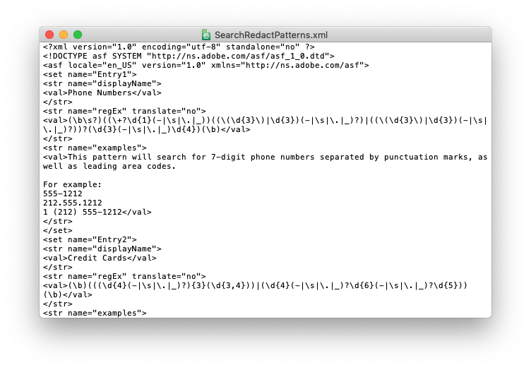
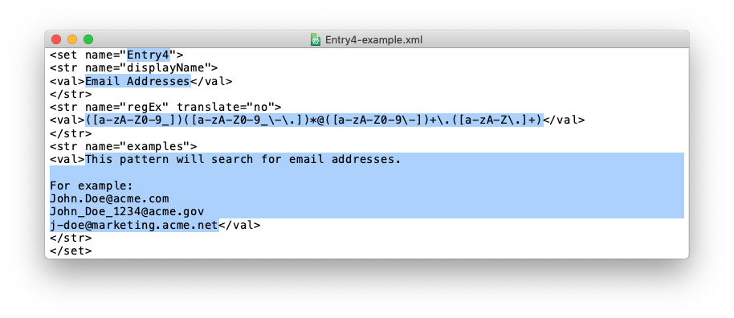

# Acrobat-redax
Regular expressions that expand Adobe Acrobat's search-and-redact functions.

- [P.O. boxes](/patterns/po-boxes.xml)
- [U.S. address number and street names](/patterns/US-street-addresses.xml)
- [ZIP and ZIP+4 codes](/patterns/ZIP-Codes.xml)

## What is this for?
Adobe Acrobat's redact tool can search for patterns; however, the functionality is limited. For example, the built-in English (US) patterns are:
- Social Security numbers
- email addresses
- phone numbers
- dates
- credit card numbers

Anyone unfortunate enough to have a light understanding of regex can add patterns. I have such an understanding. Read on and you might too.

## How do I add search redact patterns?
📂 **Open** the search redact patterns file (after backing it up)  
📝 **Create** or edit a set  
💾 **Save** the edited file  
🔏 **Restart** Acrobat and redact away  

Rick Borstein wrote about [creating and using custom redaction patterns](https://blogs.adobe.com/acrolaw/2011/05/creating_and_using_custom_redact/) on the blog [Acrolaw](https://blogs.adobe.com/acrolaw/). A good chunk of this walk-through is duplicative of Rick's great primer.

### 📂 Open the search redact patterns file (after backing it up)
Redaction patterns are stored in XML files. These files begin with the prolog `<?xml ... ?>` and end with tag `</asf>`.

Before opening or editing the search redact patterns file, it's good to make a backup copy. You might save the original, unedited version as `SearchRedactPatterns-backup.xml`.

macOS:
`/Users/<username>/Library/Preferences/Acrobat/<version>/Redaction/<locale>/SearchRedactPatterns.xml`

Windows Vista and newer:
`\Users\<username>\AppData\Roaming\Adobe\Acrobat\<version>\Preferences\Redaction\<locale>\SearchRedactPatterns.xml`. The AppData folder is hidden by default. To navigate to it, type `%AppData%` into the Windows Explorer.

Windows XP:
`\Documents and Settings\<username>\Application Data\Adobe\Acrobat\<version>\Preferences\Redaction\<locale>\SearchRedactPatterns.xml`.

**Locales**  
For each version of Acrobat on the machine, there is a pattern file for each locale that has been used. For example, if my computer has both Acrobat DC and Acrobat XI, `/Adobe/Acrobat` will contain both `/DC` and `/11`. If I have used Acrobat XI to search in Japanese and United States locales, then ``/11`` with contain  `/Redaction/JPN/SearchRedactPatterns.xml` and `/Redaction/ENU/SearchRedactPatterns.xml`.

To change locale, or to force Acrobat to create the `SearchRedactPatterns.xml` file you want to edit, open Acrobat and navigate to Preferences>Documents and select your desired locale from the dropdown menu under the Redaction heading.

You may also select from the redact search window "Choose different locale for patterns".

### 📝 Create or edit a set
Each pattern is stored as a "set" with the following syntax:
```
<set name="Entry4">
<str name="displayName">
<val>Email Addresses</val>
</str>
<str name="regEx" translate="no">
<val>([a-zA-Z0-9_])([a-zA-Z0-9_\-\.])*@([a-zA-Z0-9\-])+\.([a-zA-Z\.]+)</val>
</str>
<str name="examples">
<val>This pattern will search for email addresses.

For example:
John.Doe@acme.com
John_Doe_1234@acme.gov
j-doe@marketing.acme.net</val>
</str>
</set>
```

Simply copy a set, such as the one above, and change the entry number, pattern name, pattern, and description, as highlighted below:


### 💾 Save the edited file
Pretty self-explanatory. Don't change the file's name or location. Do have a backup!

### 🔏 Restart Acrobat
After saving the file, restart Acrobat. Open a PDF and choose the redact tool. When you search for a pattern, the dropdown menu now includes your new options!

---
## Misc.
- Save a copy of the original XML file before you begin tinkering.
- The only attribute value you need to change is the set number (e.g., "Entry5").
- In [Acrobat 9](https://helpx.adobe.com/archive/acrobat/acrobat-9-troubleshooting.pdf) and up, different patterns exist for different countries and languages ("locales"). See [locales](#-open-the-search-redact-patterns-file-after-backing-it-up) above.
- I *think* that Acrobat uses a Perl regex engine and that you might be able to switch it to Java. This is based on documentation and forums on other Adobe products, specifically [InDesign](https://community.adobe.com/t5/indesign/grep-what-is-the-base-syntax-of-indesign-grep/td-p/10321905) and [ColdFusion](https://helpx.adobe.com/coldfusion/developing-applications/the-cfml-programming-language/using-regular-expressions-in-functions/regular-expression-syntax.html). That ColdFusion page has a feature comparison table of the two engines. If the differences matter to you, then you probably don't need my help.
